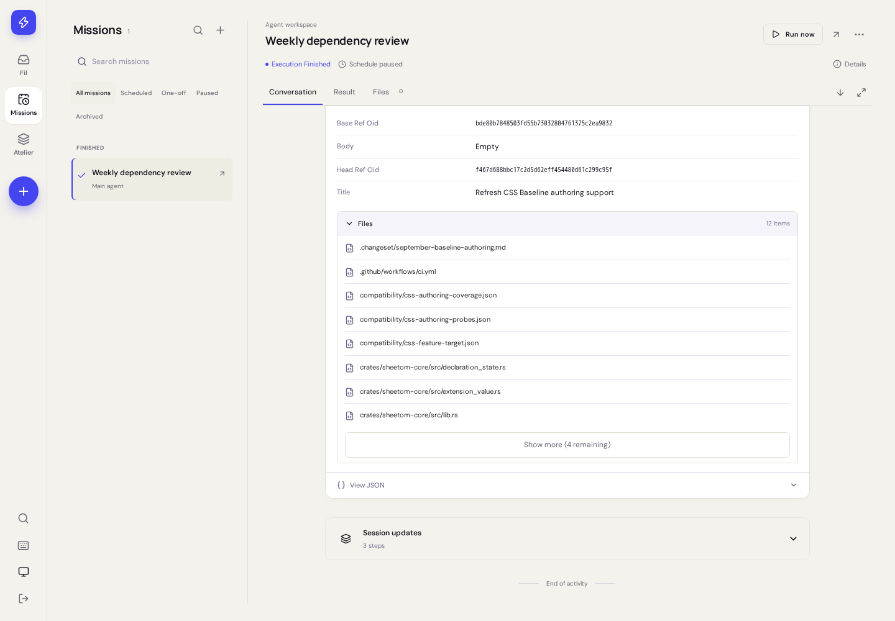

# Leo Agent Manager

A self-hosted Vue control room with a native Rust backend for Codex agents, recurring work, and reusable skills.
Run it on a VPS so schedules keep working when your laptop is off.



## What it does

- Choose Light, Dark, or System appearance, with a saved browser preference and automatic device changes.
- Create agent profiles with model, reasoning, instructions and time limits.
- Register project directories; run tasks in isolated Git worktrees or directly in a project.
- Schedule daily, weekly, or custom cron tasks with timezone previews and overlap protection.
- Follow runs, inspect results and original instructions, cancel, retry, archive tasks, and clean up reviewed worktrees.
- Edit global and project `.agents/skills`, including supporting files and Markdown previews.
- Connect multiple ChatGPT accounts through Codex device sign-in. Runs select available capacity automatically, resume across account exhaustion, and show live usage and reset windows. GitHub keeps its own device sign-in.
- Add remote and command MCP servers from the UI, sign in with OAuth on any device, discover tools, and choose each agent’s connections and tool access.
- Expose scoped tools through a **stateless MCP 2026-07-28** endpoint, with stateless compatibility for older Streamable HTTP clients, OAuth, PKCE, refresh rotation, and revocation.

The application serves one private owner workspace. The repository is public;
your credentials, projects, task instructions, and run history stay on your server.
There is no telemetry or external font/CDN dependency.

Appearance is available from the top bar, the sign-in screen, and **Settings → Appearance**.
[Theme implementation and browser QA](docs/THEMES.md) cover the palette and checks.

## Run with Docker

```sh
cp .env.example .env
# Set PUBLIC_URL to your HTTPS origin when deploying behind a reverse proxy.
docker compose up -d --build
# Read the generated bootstrap token locally; enter it in the setup screen.
docker compose exec manager cat /data/setup-token
```

Open `http://localhost:4310`, create your administrator password, then visit
**Connections → Agents → Projects → Tasks**. The Compose port is bound to localhost.
For a remote server, use an HTTPS reverse proxy or an SSH tunnel for initial setup.

[Deployment, CLI login, project setup, backups, and Coolify](docs/DEPLOYMENT.md)

[Agent toolkit, mise project versions, and automatic updates](docs/TOOLKIT.md)
provide the complete installation procedure. [MCP and OAuth](docs/MCP.md) explain
ChatGPT/Claude connection setup and the supported protocol boundary.

[Codex accounts](docs/CODEX-ACCOUNTS.md) explains selection, natural resets, and automatic session handoffs.

Chat supports images and files through the attachment button, drag-and-drop, or
pasting an image. Preview images before sending and in the conversation. Attach
up to eight files per message (10 MB each, 40 MB combined; 200 MB per chat).
Attachments work with image-only messages, queue editing, steering, and restart
recovery. PNG, JPEG, WebP, and GIF images go directly to Codex as image inputs;
other files are available for the agent to inspect with its tools. Downloads
require sign-in, and sandboxed runs receive private copies through their existing
read-only chat input mount.

[MCP connections for agents](docs/MCP-CONNECTIONS.md) covers outbound servers,
OAuth setup, tool permissions, and credential backups.

## Develop with pnpm 12

Use Node.js 24.12+ and **pnpm 12.3.4** (pinned in `package.json`).
Install Rust through rustup; `rust-toolchain.toml` pins the compiler and checks.

```sh
pnpm install --frozen-lockfile
pnpm dev
```

`pnpm install` installs a pre-commit hook that runs `pnpm lint:fix` across the
full project, including `cargo fmt --all` for Rust. If auto-fixes change tracked
files, review and stage those fixes, then retry the commit; the hook does not
stage files automatically. It then runs `cargo check` and Clippy with the locked
dependencies across every workspace member and target, including tests and
examples. Lint errors, compiler errors, and Clippy warnings block the commit.
Run `pnpm prepare` to reinstall the hook.

The UI is at `http://localhost:5178`; the backend is at `http://localhost:4310`.
The UI uses Tailwind CSS and Egoist's Iconify plugin. See the
[styling conventions](docs/UI-STYLING.md) for shared controls, theme tokens, icons,
and responsive layout rules.
By default, the worker uses your home directory and existing CLI accounts. Set
`AGENT_HOME`, `DATA_DIR`, and `WORKSPACE_ROOTS` for a separate environment. See
[.env.example](.env.example); environment variables must be exported for local CLI
runs (`.env` is used by Compose, not loaded automatically by the development server).

```sh
pnpm check                       # ESLint, rustfmt, types, JS tests and frontend build
cargo test --workspace           # Native backend integration and migration tests
cargo clippy --all-targets -- -D warnings
cargo build --bin leo            # Native binary used by every browser fixture
pnpm exec playwright install chromium
pnpm test:e2e                    # Full browser journeys against the Rust backend
pnpm build:backend               # Optimized native production binary
node --import tsx scripts/benchmark-backend.mjs # Node/Rust comparison
pnpm lint:fix                    # ESLint fixes and Rust formatting
```

Browser tests start a separate application, isolated home, and fixture project;
they never use your Codex credentials. The fixture runner is only in the test suite
and is absent from the production image.

[Rust backend architecture and migration](docs/RUST-BACKEND.md) describes the
runtime, database compatibility, execution supervision and performance evidence.

## Operations and boundaries

- Run **one application process per data volume**. SQLite persists the queue and sessions.
- One active run per task, one executing run per project, and 1–4 global workers.
- After downtime, schedules catch up once. Active conversations resume automatically with their saved workspace and remaining timeout. Explicitly stopped runs stay stopped and can be resumed from the run view. See [restart recovery](docs/RESTART-RECOVERY.md).
- Retry uses the task's current configuration; the previous run's snapshot stays intact.
- Worktrees preserve changes for review. Cleanup rejects dirty/untracked files and preserves Git branches.
- Event output is bounded per run and expires after 30 days for finished runs; audit entries expire after 90 days. Run summaries and worktrees remain until deliberately managed.
- Tasks choose an agent. The built-in Main agent sees all registered resources; other agents can restrict projects, skills, and GitHub connections. YOLO remains the default, with optional workspace-write and read-only execution. See [agent access](docs/AGENT-ACCESS.md) for isolation and setup. MCP `run` grants can trigger task-authorized external actions.
- Other model providers, multi-owner tenancy, stateful MCP sessions, and standalone HTTP+SSE transports are outside this version.

[Detailed delivery plan](docs/PLAN.md) · [Validation record](docs/QA.md) ·
[Performance measurements](docs/PERFORMANCE.md) · [Security](SECURITY.md)

CI runs quality checks and isolated browser suites alongside a container build and
non-root smoke test. Image tags are published only after all checks pass. Release
tags reuse the exact image already validated on main, then verify the deployed
commit. See the [CI measurements and release paths](docs/CI-PERFORMANCE.md).

## Chats

Start a conversation from **Chats**, an agent, or a project. Project chats use Main agent by default. Steer a live response, queue and edit follow-ups, and resume conversations after a restart. See [chat behavior and architecture](docs/chats.md).
